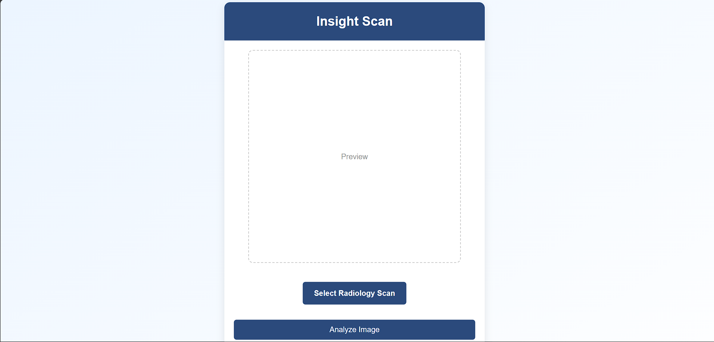

# Insight Scan

**A lightning-fast AI radiology assistant powered by a fine-tuned LLaMA-3.2-Vision model**

---

## 🚀 Overview

Insight Scan enables clinicians and developers to upload radiology scans (e.g., chest X‑rays) and receive expert-level, AI-generated reports in seconds. Built with a React+Vite frontend, a FastAPI+Hugging Face Transformers backend, and parameter-efficient fine‑tuning via Unsloth (QLoRA) on the Radiology‑Mini dataset.



## 🔑 Key Features

- **Instant AI Reports**: From image upload to a structured radiology report in under 5 seconds.
- **Upload History**: Track your recent scans and generated reports.
- **Real-Time Progress**: WebSocket-based status updates during inference.
- **Modular Architecture**: Easily swap in new models or datasets.

## 🏗️ Architecture & Tech Stack

| Component     | Technology                              |
| ------------- | ---------------------------------------- |
| Frontend      | React, Vite, TypeScript, Tailwind CSS    |
| Backend       | Python, FastAPI, Uvicorn, ngrok         |
| Model Serving | Hugging Face Transformers (`LlamaForVision2Seq`) |
| Fine-Tuning   | Unsloth QLoRA (4-bit adapters)          |
| Dataset       | Radiology-Mini (real images & captions) |


## 📦 Getting Started

Follow these steps to run Insight Scan locally on your machine.

### Prerequisites

- **Node.js** (v16+)
- **Python** (v3.10+)
- **ngrok** (for secure tunnel)
- **Git** (for cloning)
- **Hugging Face account** with an access token

### How to run this project

1. **Clone the Repository**

```bash
git clone https://github.com/your-username/insight-scan.git
cd insight-scan
```

2. **Run code-cells in llama-vision-finetune-health-inference.ipynb**

3. **You will get ngrok api link as the ouput, paste it in vite-frontend/src/App.jsx**:

4. **Now, to start your frontend run following commands**
   ```bash
    cd vit-frontend
    npm run dev
   ```
   
5. **Open in browser**: Navigate to `http://localhost:5173`

## 📝 Usage

1. Click **Upload Scan** and select a radiology image (e.g., `.png`, `.jpg`).
2. Watch the real-time progress indicator as the model analyzes your image.
3. View the generated report in the results card.

## 🚧 Fine‑Tuning Details

We leveraged the Unsloth QLoRA framework to fine‑tune LLaMA-3.2-Vision on the Radiology‑Mini dataset:

- **Adapter Type**: 4-bit low‑rank adapters in cross‑attention layers
- **Frozen Parameters**: >98% of base model
- **Training Hardware**: Single Tesla T4 (15 GB)
- **Prompt Templates**: Dynamic instructions such as "Report any anomalies:" or "Summarize key findings:".
